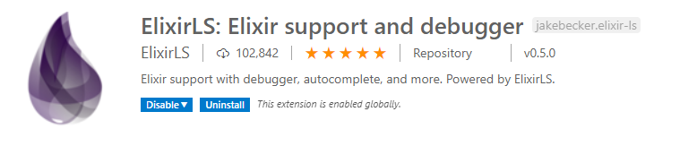

# Oppgave 1: Maskinoppsett

## Nødvendige verktøy

:wrench: For å komme i gang trenger du først å laste ned Elixie. Du finner riktig installer for ditt operativsystem hos [elixir-lang.org](https://elixir-lang.org/install.html).

:wrench: Om du ikke har Visual Studio Code installert, kan du laste det ned hos [code.visualstudio.com](https://code.visualstudio.com/Download)

:wrench: Visual Studio Code Extension `ElixirLS` er anbefalt når du skal jobbe med Elixir. Denne finner du i søket under "Extensions" i Visual Studio Code. 

<p align="center">
  
</p>

## Test av installasjon

Det er laget en katalog som inneholder et startprosjekt som du kan arbeide i. For å teste om du fått installert Elixir, kan du gå inn i katalogen `workshop_code` i en terminal og skrive `mix test`. Dette kjører en enhetstest som er definert. Dersom alt har gått bra, skal du se følgende output i terminalen din.

```
Finished in 0.01 seconds (0.00s async, 0.01s sync)
1 test, 0 failures
```

Hurra! Houston, we are ready for launch! :rocket:

Gå videre til [Oppgave 2 - IEx & REPL ](./oppgave2.md) :arrow_right: